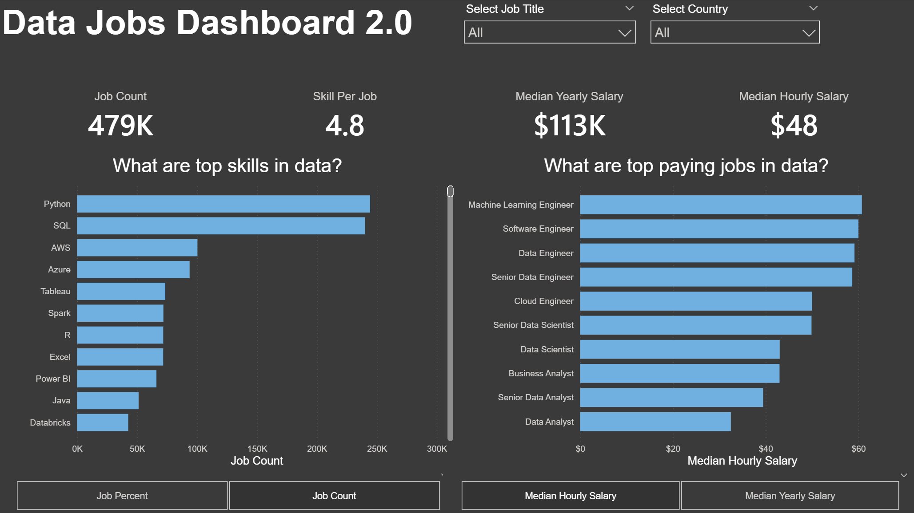

# 📊 Data Jobs Dashboard 2.0
## 🎯 Project Overview
This interactive Power BI dashboard provides a comprehensive analysis of the global data job market. By visualizing data from over 479,000 job postings, it helps aspiring data professionals and recruiters understand the landscape of top skills, high-paying roles, and salary benchmarks.

## 🚀 Key Features
Market Scale: Insight into total job counts and the average number of skills required per posting (currently averaging 4.8).

Skill Demand Analysis: A breakdown of the most sought-after technologies, showing Python and SQL as the clear leaders.

Salary Benchmarking: Real-time visualization of median hourly and yearly salaries across various job titles.

Dynamic Filtering: Users can drill down into specific job titles or countries to get localized insights.

Toggle Views: Ability to switch between "Job Count" and "Job Percent," as well as "Hourly" vs "Yearly" salary metrics.

## 🛠️ Tech Stack
Visualization Tool: Power BI Desktop

Data Modeling: Star Schema (using dimension and fact tables)

DAX: Used for calculating complex measures like Median Salaries and Skill Percentages.

Data Source: Large-scale dataset containing job titles, skills, and compensation details.

## 💡 Key Insights from the Dashboard
The Big Two: Python and SQL remain the foundational skills for any data role, appearing in significantly more listings than other tools.

Cloud Dominance: AWS and Azure are the top cloud skills, beating out specific visualization tools like Tableau or Power BI in terms of raw frequency.

Top Earners: Machine Learning Engineers and Software Engineers currently command the highest median hourly rates, followed closely by Data Engineers.

The Gap: Senior roles show a notable jump in salary, emphasizing the value of experience in the current market.

## 📂 How to Use
Clone the Repo: Download the .pbix file.

Open in Power BI: Ensure you have the latest version of Power BI Desktop.

Interact: Use the slicers at the top to filter by Job Title or Country. Click on the buttons at the bottom of each chart to toggle between different metrics.
